# 🌿 青稞绿植 — 智慧绿植养护管理系统

> 一个面向绿植爱好者的全栈项目：植物知识科普、AI 识别与病害诊断、养护记录与提醒、社区互动，以及完整的后台管理系统。

### 项目缘起与定位

本项目最初按**商用上线**标准设计：完成了域名选型与备案方案调研，架构上按生产环境要求落地了 JWT 角色鉴权、敏感配置外置、AOP 操作审计、统一异常边界等工程实践。

在推进公开部署的过程中，对照《互联网信息服务算法备案管理规定》与《生成式人工智能服务管理暂行办法》逐项评估后确认：**生成式 AI 服务（病害诊断、AI 客服）与 UGC 模块（社区发帖、评论、私信）的备案主体仅限企业**，个人开发者无法完成合规手续。与其带着合规风险上线，我选择将项目定位调整为**本地运行的完整演示版（Demo）**——所有核心业务链路均可在本地复现，仅剥离了依赖企业资质的第三方服务环节。

### 功能范围调整说明

相比最初的商用蓝图，当前仓库移除了以下**必须企业资质或外部服务支撑**的环节，其余功能全部保留：

| 移除项 | 原设计 | 移除原因 | 现行替代 |
|---|---|---|---|
| 邮箱验证码注册 | `SysEmailVerifyCode` 实体 + 发送验证码接口 + spring-boot-starter-mail | 邮件外发需备案域名与邮箱资质 | 注册仅保留账号/密码/密保校验 |
| 提醒实时触达 | WebSocket 将到期提醒实时推送到在线用户浏览器 | 需 7×24 服务器值守，且主动推送属受限服务 | 提醒由 Quartz 生成后落入站内通知（sys_notice），用户登录后在提醒页查看；WebSocket 推送作为预留扩展点 |
| 第三方登录（微信等） | 微信扫码 / 公众号 OAuth 授权登录 | 开放平台仅对企业主体开放认证（需营业执照） | 账号密码 + JWT 登录 |
| AI 生成式服务上线 | 病害诊断与 AI 客服对外提供服务 | 算法备案主体仅限企业 | 代码完整保留，本地配置个人 API Key 即可运行 |
| 社区 UGC 上线 | 发帖/评论/关注/私信/访客 | 个人非经营性备案不得开展 UGC 业务 | 代码与后台审核模块完整保留，仅不对外部署 |

> 这段"做减法"的经历本身也是项目的一部分：**合规评估 → 架构取舍 → 无侵入降级**，是我在这个项目中获得的超出技术栈本身的收获。

## 🌟 项目亮点

### 产品设计：一套应用，两种性格

- **双主题视觉体系**：用户端与管理端共用一个 SPA，却各自拥有完整独立的视觉语言——
  - **用户端 · 清新卡通风**：贴合"绿植养护"的温度感。薄荷绿主色、大圆角卡片、渐变色彩块，弹窗标题自带 🌿 叶片摇曳动画（`leaf-sway` keyframes），弱化"工具感"、强化"陪伴感"；
  - **管理端 · 深色科技风**：`#0a1929` 深空底色 + 青绿荧光描边（`--admin-accent: #00bfa5`）、卡片内发光阴影、Orbitron 等宽数字字体渲染统计指标，突出数据密度的"驾驶舱"气质。
  - 两套主题按路由前缀作用域隔离（`.admin-dark` 类名限定），互不污染，通过一个 `import` 即可整体换肤。
- **深度定制而非套壳**：通过 SCSS `@forward` 重定义 Element Plus 色板，并在 `global.css` 中对按钮、输入框字数统计、分页、消息框、滚动条逐一做主题化覆写，组件库"隐形"、品牌感统一。
- **细节体验**：管理端弹窗支持**四角 + 四边 8 向拖拽缩放**（高密度操作场景下自由布局）；首页功能入口以渐变色卡片区分语义；新手引导页降低首次使用门槛。

### 功能设计：完整闭环的业务巧思

- **一次调用，双重智能**：AI 识别与病害诊断合并为**单次多模态调用**（GLM-4.6V-Flash），一次拍照同时返回"这是什么植物 + 它得了什么病 + 怎么治"，节省一半 API 成本与用户等待。
- **积分经济闭环**：每日签到赚积分 → AI 识别按次扣积分（10 分/次）→ **调用失败自动退积分**。扣减采用 SQL 原子操作（`points >= cost` 条件更新）防并发超扣，失败补偿保证"用户不为服务端故障买单"。
- **多 Key 轮询池 + 失败降级**：智谱 API 配置多个 Key 轮转分摊免费额度，单 Key 限流/故障自动切换重试，最后兜底降级提示。
- **UGC 全链路 + 审核工作流**：发帖 / 评论树（主评论 + 分页回复）/ 点赞 / 关注 / 访客足迹 / 私信，管理端配套**先审后发**机制（`auditStatus` 状态机），完整复刻内容平台治理形态。
- **注解式操作审计**：自定义 `@OperationLogAnnotation` + AOP 切面，关键操作零侵入自动留痕（操作人、IP、模块、耗时），日志异步落库不阻塞主流程。
- **异常可观测性**：全局异常处理器捕获所有未处理异常并**持久化到 `system_error` 表**（模块、类型、堆栈、请求 URL），管理端"错误中心"可视化查询与一键清空——把"报错"变成可运营的资产。
- **自动化养护提醒**：Quartz 每小时扫描养护记录，按周期批量生成站内提醒，用户登录即在通知中心可见，形成"记录 → 提醒 → 回访"留存闭环。

## ✨ 核心功能

### 用户端

| 模块 | 说明 |
|---|---|
| 🌱 植物知识库 | 植物养护知识分类浏览、搜索、详情阅读，按热度（点击/收藏）排序 |
| 📷 AI 植物识别 | 拍照上传，智谱 GLM-4.6V-Flash 多模态大模型一步返回植物名称、简介与置信度（消耗积分，10 积分/次） |
| 🩺 AI 病害诊断 | 同一次识别中由大模型分析病害症状，给出诊断与养护建议（多 API Key 轮询池，失败自动退积分） |
| 💬 AI 客服助手 | 基于大模型的绿植养护问答，支持图片提问，聊天记录持久化 |
| ❤️ 收藏 / 👤 个人中心 | 知识收藏、个人资料、安全设置、积分签到 |
| 🔔 养护提醒 | 记录养护周期，Quartz 定时任务批量生成提醒，站内通知展示（提醒页） |
| 👥 社区 | 发帖、评论、点赞、关注、访客记录、私信（消息中心） |

### 管理端（后台）

- 用户管理、植物知识/分类的增删改查与审核
- 社区帖子/评论审核管理
- 系统公告发布、通知管理
- 数据统计面板（ECharts 可视化：用户增长、内容分布等）
- 操作日志（AOP 切面自动记录关键操作）

## 🛠 技术栈

| 层 | 技术 |
|---|---|
| 前端 | Vue 3.5 · Vite 7 · Element Plus 2.11 · ECharts 5.5 · Sass |
| 后端 | Spring Boot 3.2（Java 17）· MyBatis-Plus · PageHelper · Quartz · JWT |
| AI | 智谱 GLM-4.6V-Flash（OkHttp 调用，多 Key 轮询 + 降级） |
| 数据 | MySQL 8（HikariCP） |

> 架构设计、选型理由与实现细节见 [docs/DESIGN.md](docs/DESIGN.md)。

## 📁 项目结构

```
qingke/
├── Springboot/                  # 后端服务（controller / service / mapper / common / config / interceptor）
├── Vue/                         # 前端应用（api / router / store / views/user / views/admin / components）
├── db/qingke.sql                # 数据库建表脚本
├── docs/                        # 设计文档与界面截图
├── PRD.md                       # 产品需求文档
└── README.md
```

> 双端 SPA 架构（路由前缀 + JWT 角色声明分离）说明见 [docs/DESIGN.md § 2](docs/DESIGN.md)。

## 🚀 快速启动

### 环境要求

- JDK 17+、Maven 3.6+、Node.js 18+、MySQL 8.x

### 1. 初始化数据库

```sql
CREATE DATABASE qingke DEFAULT CHARACTER SET utf8mb4;
```

导入 `db/qingke.sql` 建表脚本：

```bash
mysql -u root -p qingke < db/qingke.sql
```

### 2. 配置密钥

敏感配置不入库，有两种方式任选：

- **环境变量**：`MYSQL_PASSWORD`、`ZHIPU_API_KEY_1..5`、`JWT_SECRET`
- **本地文件**：在 `Springboot/src/main/resources/` 下创建 `application-local.yml`，覆盖对应配置项

### 3. 启动后端

```bash
cd Springboot
mvn spring-boot:run        # 默认端口 8080
```

### 4. 启动前端

```bash
cd Vue
npm install
npm run dev                # Vite 开发服务器，/api 自动代理到 8080
```

浏览器访问终端提示的地址即可。

## 🔑 第三方服务申请

| 服务 | 用途 | 申请地址 |
|---|---|---|
| 智谱 AI GLM-4.6V-Flash | 植物识别 / 病害诊断 / AI 客服 | https://open.bigmodel.cn/ |

> 有免费额度，注册创建应用后把 Key 填入第 2 步即可（支持配置多个 Key 轮询分摊限额）。

## 📸 界面预览

> 截图待补充：将对应图片放入 `docs/screenshots/` 目录（文件名如下）即可自动显示。

| 登录/注册 | 首页 |
|---|---|
| 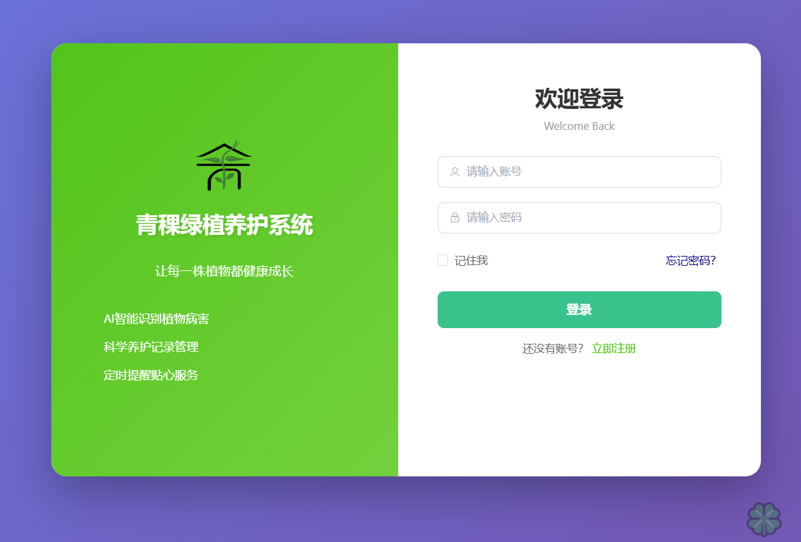 | 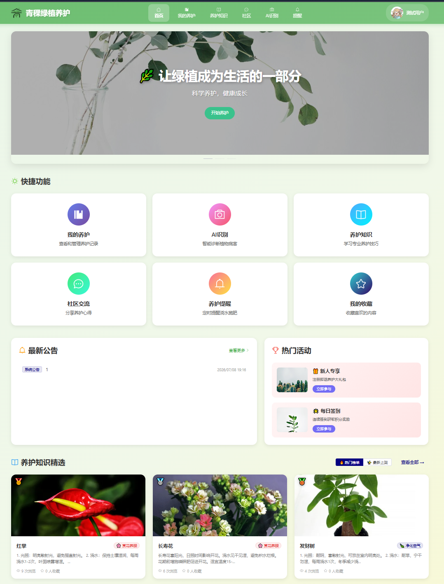 |

| 我的养护 | 养护知识 |
|---|---|
| 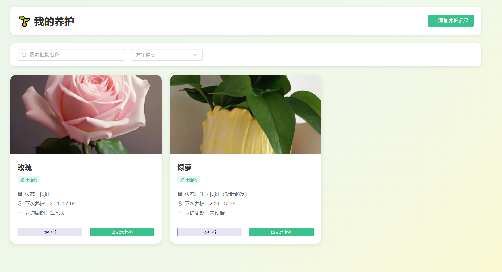 | 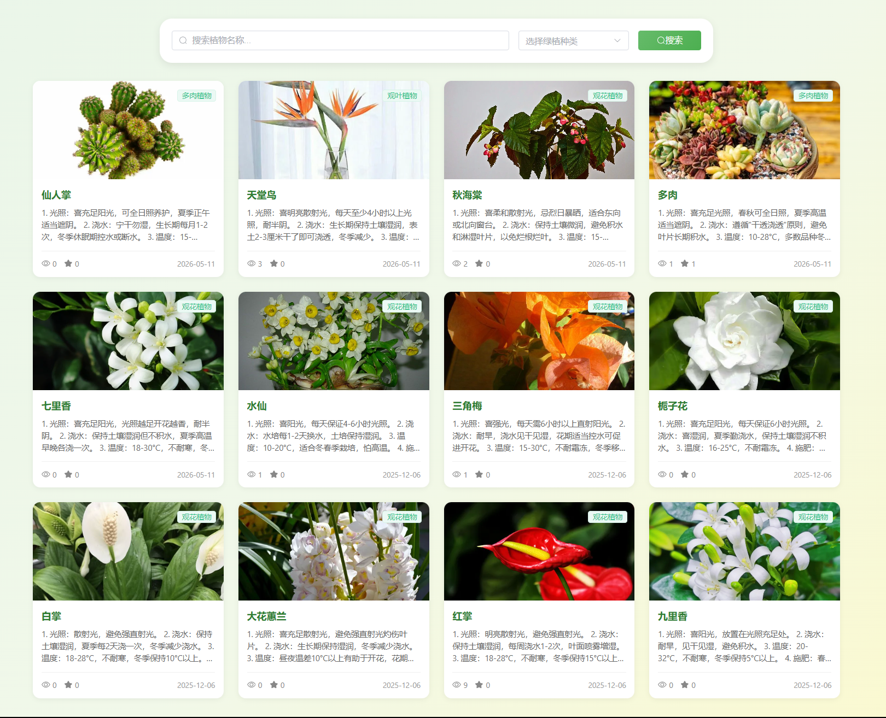 |

| 社区 | AI 识别 |
|---|---|
| 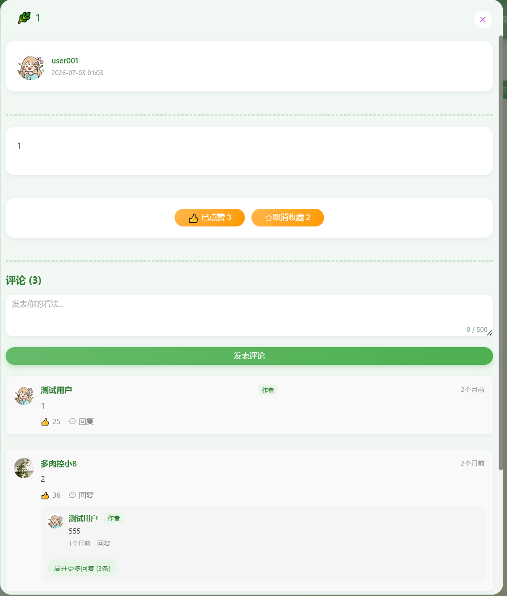 | 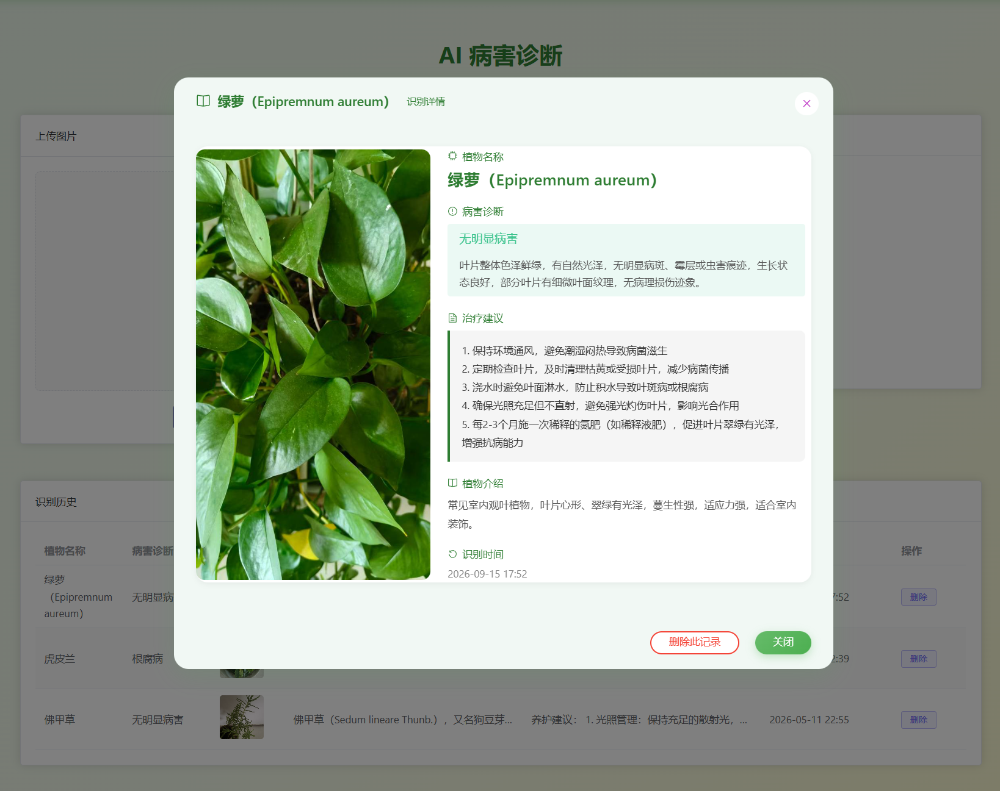 |

| 提醒 | AI 客服 |
|---|---|
| 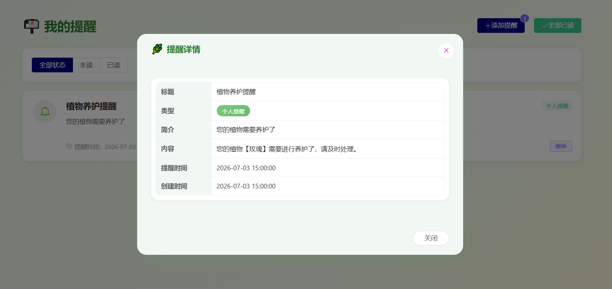 | 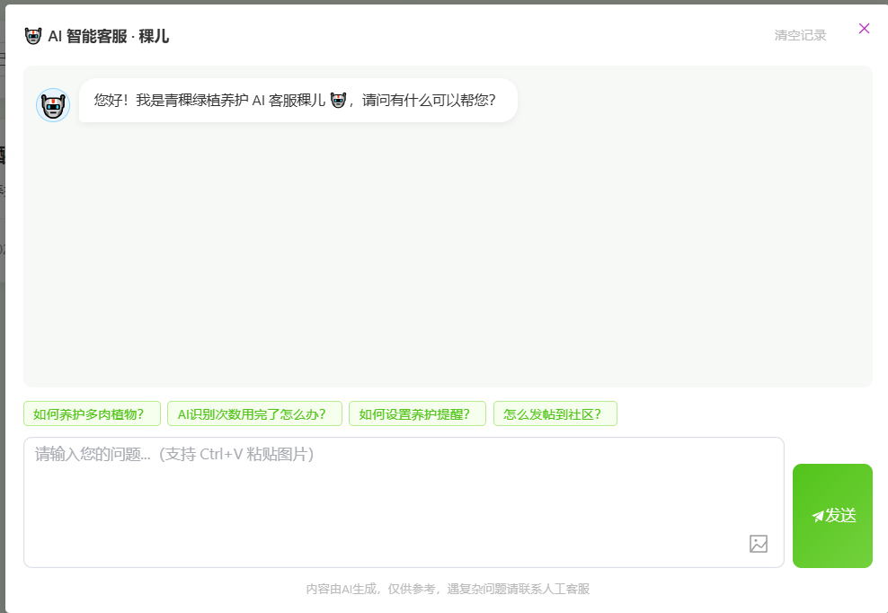 |

### 管理端

| 数据面板（首页） | 用户管理 |
|---|---|
| 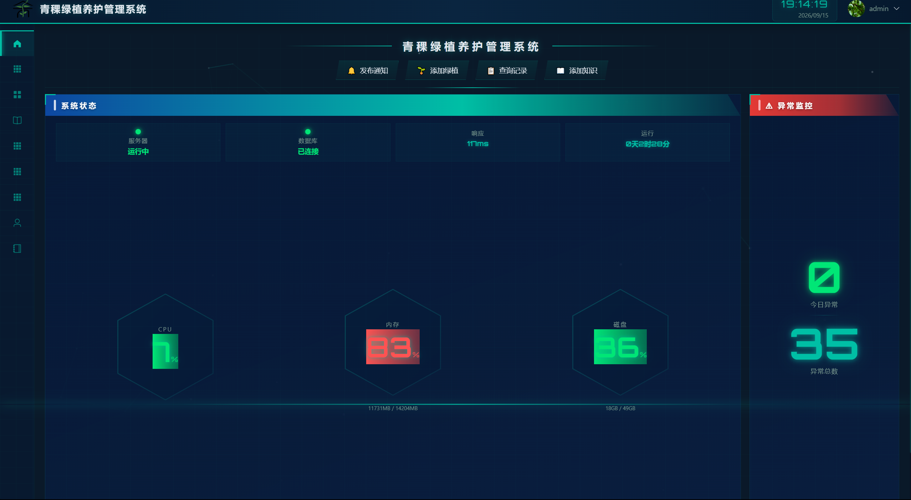 | 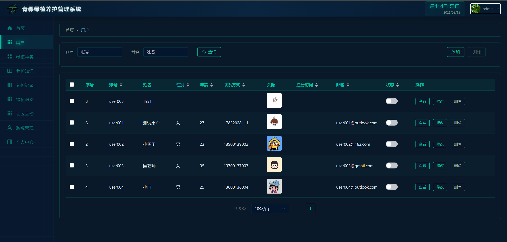 |

| 绿植种类管理 | 养护知识管理 |
|---|---|
| 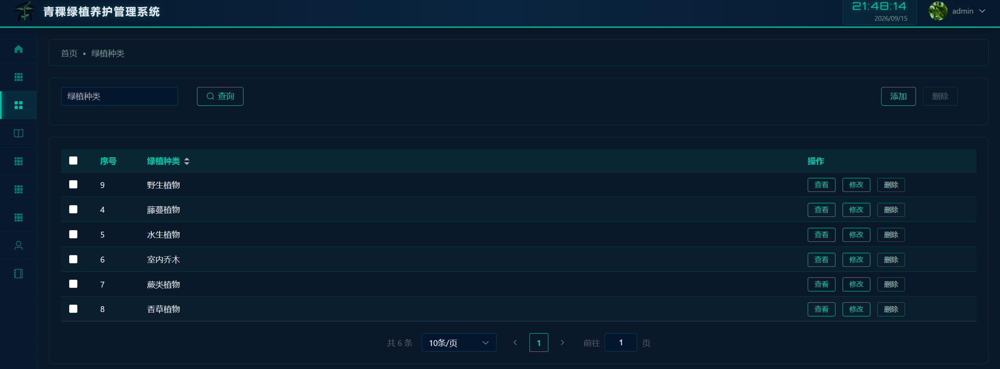 | 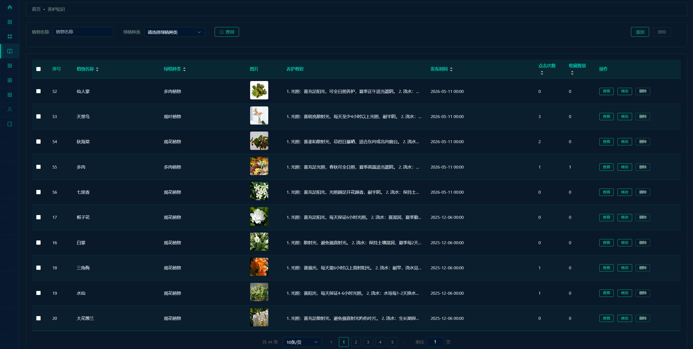 |

| 绿植识别记录 | 养护记录管理 |
|---|---|
| 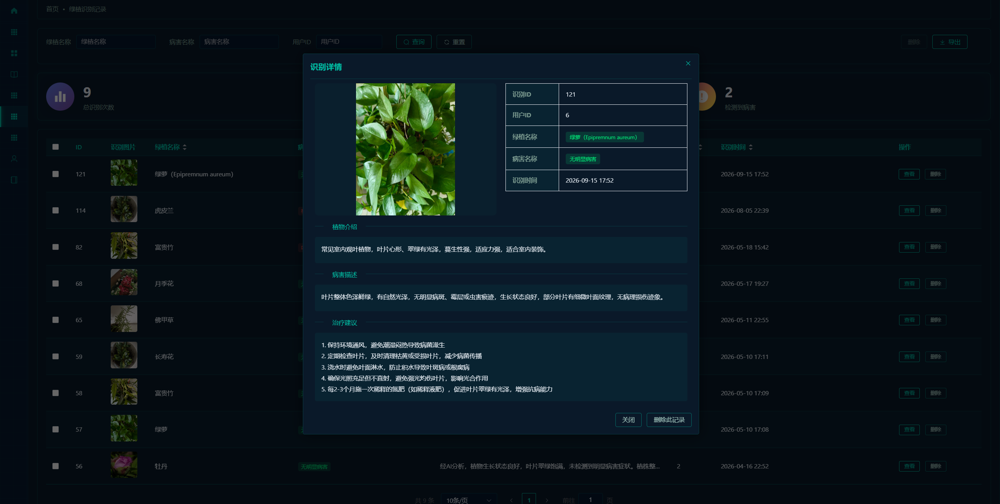 | 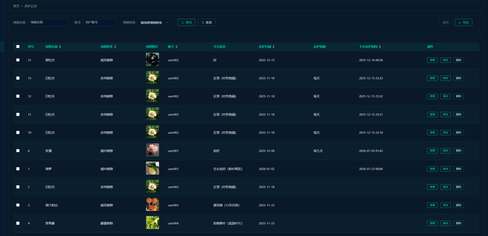 |

| 社区互动审核 | 系统管理 |
|---|---|
| 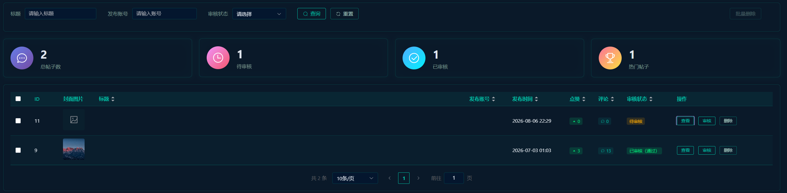 | 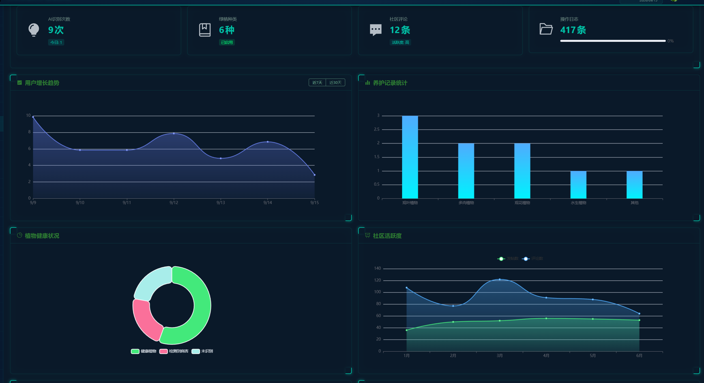 |

## 📄 License

本项目仅为个人学习与作品展示用途，代码可自由阅读参考。
