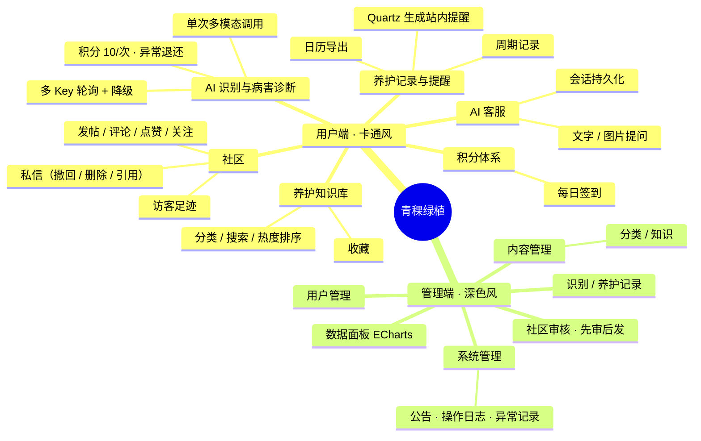
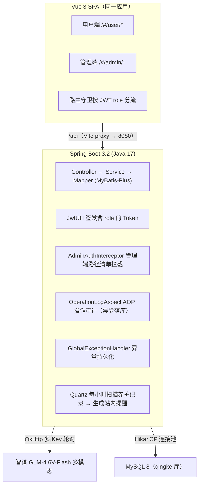
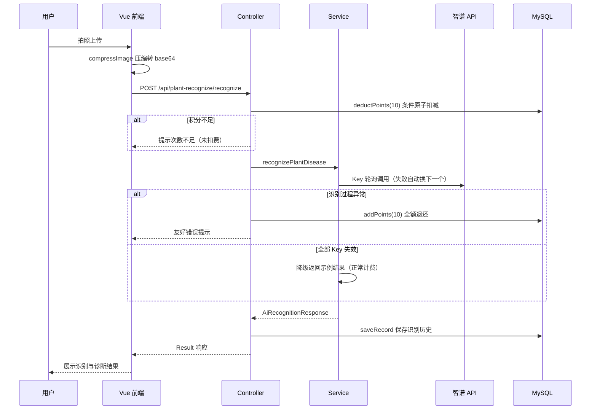
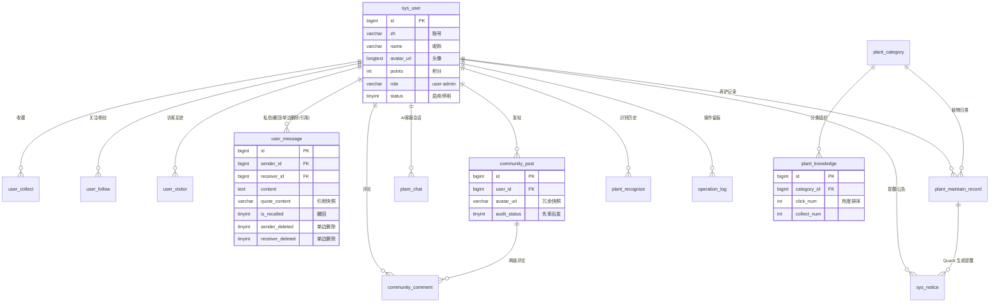
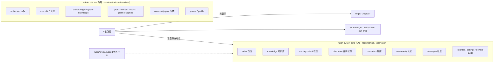

# 青稞绿植 · 设计与开发文档

> 本文档面向开发者，覆盖系统架构、技术选型、数据库设计、前后端实现要点与开发规范。
> 产品需求（业务行为、规则、验收）见 [PRD.md](../PRD.md)，项目总览与说明见 [README.md](../README.md)。

## 目录

- [1. 项目概述](#1-项目概述)
- [2. 系统架构设计](#2-系统架构设计)
- [3. 技术选型](#3-技术选型)
- [4. 数据库设计](#4-数据库设计)
- [5. 后端设计](#5-后端设计)
- [6. 前端设计](#6-前端设计)
- [7. UI 设计与排版规范](#7-ui-设计与排版规范)
- [8. 开发指南](#8-开发指南)
- [9. 附录](#9-附录)

---

## 1. 项目概述

### 1.1 定位

智慧绿植养护管理系统，Vue 3 + Spring Boot 3 + MySQL 全栈项目。功能闭环：
**AI 识别诊断 → 养护记录 → 周期提醒 → 社区互动 → 后台治理**。

当前为本地运行完整演示版（Demo），生成式 AI 与 UGC 模块因备案主体限制不对外部署，代码链路完整保留（详见 README「功能范围调整说明」）。

### 1.2 功能全景



### 1.3 仓库结构

```
qingke/
├── Springboot/          # 后端服务（8080）
├── Vue/                 # 前端应用（Vite dev / 构建产物由后端或 Nginx 托管）
├── db/qingke.sql        # 建表 + 初始化数据脚本
├── docs/                # 本设计文档与截图
│   ├── screenshots/     # 16 张界面截图（用户端 8 + 管理端 8）
│   └── images/          # 补充设计图（核心图表已用 Mermaid 内嵌）
├── PRD.md               # 产品需求文档
└── README.md            # 项目说明与快速启动
```

---

## 2. 系统架构设计

### 2.1 总体架构



### 2.2 一次 AI 识别的时序



### 2.3 鉴权设计

- 登录成功签发 JWT（jjwt 0.11.5），载荷含 `userId` 与 `role`（user/admin）。
- 前端 Axios 拦截器统一携带 Token；401 统一清理会话并引导重新登录。
- 路由守卫：`requiresAuth` 未登录 → 按路径前缀跳对应登录页并带 `redirect` 回跳；角色不匹配 → 重定向至本角色首页。
- 后端 `AdminAuthInterceptor` 按路径清单拦截管理端敏感接口，普通用户 Token 无法越权。
- 密钥经环境变量 `JWT_SECRET` 注入，不落源码；敏感配置统一 `${VAR:default}` 占位（application.yml），真实值放 `application-local.yml`（已被 .gitignore 排除）。

---

## 3. 技术选型

| 层 | 技术 | 版本 | 用途 |
|---|---|---|---|
| 前端框架 | Vue | 3.5 | Composition API SPA |
| 构建 | Vite | 7 | 开发服务器 / 产物构建，/api 代理 |
| 路由/状态 | Vue Router / 自建 reactive store | 4.x | 双端路由守卫 / 用户会话 |
| UI 组件 | Element Plus | 2.11 | 按需自动导入（unplugin） |
| 可视化 | ECharts | 5.5 | 管理端统计图表 |
| HTTP | Axios | —— | JWT 拦截器、统一错误处理 |
| 样式 | Sass | —— | 双主题变量体系 |
| 后端框架 | Spring Boot | 3.2.4 | Java 17 |
| ORM | MyBatis-Plus | 3.5.9 | CRUD + 自定义 XML |
| 分页 | PageHelper | 2.1.0 | 物理分页 |
| 鉴权 | jjwt | 0.11.5 | Token 签发与校验 |
| 调度 | Quartz | —— | 每小时生成养护提醒 |
| AI 通道 | OkHttp | 4.12.0 | 调用智谱多模态 API |
| 工具 | Hutool / Lombok | —— | 通用工具 / 样板代码消除 |
| 数据库 | MySQL | 8.x | utf8mb4；HikariCP 连接池（max 16 / min 4） |

**选型理由摘要**：MyBatis-Plus 兼顾通用 CRUD 与复杂联表（评论树、统计）；JWT 无状态适配单机部署；Quartz 相对 `@Scheduled` 提供集群化扩展点；智谱 GLM-4.6V-Flash 有免费额度且多模态一次调用即可完成"识别+诊断"，成本减半。

---

## 4. 数据库设计

### 4.1 ER 总览

16 张表，以 `sys_user` 为中心分四组：



> `sys_email_verify_code` 为邮箱验证裁剪后的遗留表，保留结构未启用；`system_error` 独立记录全局异常。
> 帖子/评论/聊天/识别记录冗余存头像昵称，`SysUserServiceImpl.update()` 资料变更时同步刷新（§5.2）。

### 4.2 表清单与关键设计

| 表 | 说明 | 设计要点 |
|---|---|---|
| sys_user | 用户 | `points` 原子条件更新防超扣；`role` 区分 user/admin；头像 longtext 存 URL/base64 |
| plant_category / plant_knowledge | 分类与知识 | 知识含 `click_num`/`collect_num` 支撑热度排序 |
| community_post / community_comment | 帖子与评论 | `audit_status` 先审后发状态机；评论 `parent_id` 两级结构 |
| user_message | 私信 | `quote_content` 引用快照；`is_recalled` 双方占位；`sender_deleted`/`receiver_deleted` 单边删除 |
| user_visitor | 访客 | 同日同访客去重；`is_read` 驱动未读角标 |
| plant_maintain_record | 养护记录 | 周期字段驱动 Quartz 提醒生成 |
| plant_recognize | 识别历史 | 冗余用户快照（头像同步机制一并更新） |
| operation_log / system_error | 治理 | AOP 异步落库 / 全局异常处理器落库 |

**冗余快照一致性**：帖子/评论/聊天/识别记录冗余存 `avatar_url` 与昵称，`SysUserServiceImpl.update()` 在资料变更后同步刷新全部冗余表，保证全站即时一致。

### 4.3 初始化

```bash
mysql -u root -p -e "CREATE DATABASE qingke DEFAULT CHARACTER SET utf8mb4;"
mysql -u root -p qingke < db/qingke.sql
```

---

## 5. 后端设计

### 5.1 包结构

```
com.qingke
├── common/        Result<T> 统一响应 / JwtUtil / GlobalExceptionHandler
│   └── job/       GenerateCareRemindersJob（Quartz 每小时扫描生成提醒）
│   OperationLogAnnotation + OperationLogAspect（AOP 审计）
│   BusinessException / CorsConfig
├── config/        WebConfig（拦截器注册）/ QuartzConfig / ZhipuAiConfig
├── controller/    REST 接口（用户端 + 管理端）
├── entity/        实体与 DTO（VisitorDTO、ConversationDTO、AiRecognitionResponse…）
├── exception/     RateLimitException（AI 限流识别）
├── interceptor/   AdminAuthInterceptor（管理端路径清单鉴权）
├── mapper/        MyBatis-Plus BaseMapper + 自定义 XML
└── service/       接口 + impl 分层
```

### 5.2 关键实现

**统一响应与异常边界**：所有接口返回 `Result<T>`（code/message/data）；`GlobalExceptionHandler` 捕获未处理异常持久化到 `system_error`（模块/类型/URL/堆栈），管理端"异常记录"可视化查询。

**积分经济**：签到 `addPoints`；识别 `deductPoints` 用 `UPDATE ... SET points = points - 10 WHERE points >= 10` 条件原子更新；识别过程异常 catch 后 `addPoints` 全额退还；全部 API Key 失效时降级返回示例结果（正常计费，保证演示链路）。

**AI 多 Key 轮询池**（ZhipuAiServiceImpl）：`AtomicInteger` 轮转起始位，逐个尝试、单 Key 失败自动换下一个；`RateLimitException` 识别限流场景。

**私信三操作**：撤回（仅发送者、2 分钟内、双方占位）；删除（`sender_deleted`/`receiver_deleted` 单边标记，列表查询按可见性过滤）；引用（发送时存被引文本快照，渲染引用块）。

**AOP 审计**：`@OperationLogAnnotation(module, type, description)` 标注关键操作，切面记录操作人/IP/耗时异步落库，不阻塞主流程。

**提醒链路**：Quartz 每小时扫描 `plant_maintain_record`，按周期为到期项写 `sys_notice`；前端登录后提醒弹窗 + 提醒中心处理（完成/忽略），支持 .ics 日历导出。

---

## 6. 前端设计

### 6.1 目录结构

```
Vue/src
├── api/index.js       按模块分组的 Axios 封装（JWT 拦截器、401 处理、响应码拦截）
├── router/index.js    双端路由树 + 守卫（requiresAuth / role / redirect 回跳）
├── store/index.js     reactive 会话：setUser/logout/restoreUser/Token 过期检测
├── assets/            图片资源、全局样式
├── components/common/ CustomerService(AI客服) / CareReminderDialog(提醒弹窗) 等
└── views/
    ├── user/          UserHome 布局 + 11 页面（Index/Knowledge/AiDiagnosis/
    │                  PlantCare/Reminders/Community/UserProfile/Favorites/
    │                  Messages/Settings/NewbieGuide）
    └── admin/         Home 布局 + 10 页面（Dashboard/Users/PlantCategory/
                       PlantKnowledge/PlantMaintainRecord/PlantRecognize/
                       CommunityPost/SystemManage/Profile + AdminLogin）
```

### 6.2 路由结构



### 6.3 实现要点

- **双主题同应用**：路由前缀作用域隔离（`.admin-dark` 类名限定），互不污染。
- **会话同步**：资料保存后 `store.setUser()` 同步响应式 store，顶栏等 computed 消费方即时刷新；`localStorage` 仅作持久化与恢复。
- **按需加载**：路由组件全部 `() => import()` 懒加载；Element Plus 经 unplugin 自动导入。
- **图片处理**：AI 识别上传前端压缩（canvas）后转 base64，5MB/格式限制前置提示。
- **私信页**：会话列表 + 聊天窗双栏；消息悬停操作（引用/撤回/删除）；打开会话即标记已读。

---

## 7. UI 设计与排版规范

### 7.1 双主题体系

| 维度 | 用户端 · 清新卡通 | 管理端 · 深色科技 |
|---|---|---|
| 底色 | 浅色系（#f5f7fa 内容区） | #0a1929 深空底 |
| 主色 | 薄荷绿 #4caf50 系渐变 | 青绿荧光 --admin-accent: #00bfa5 |
| 卡片 | 大圆角、柔和阴影、渐变色块 | 内发光描边、高密度布局 |
| 数字 | 常规字体 | Orbitron 等宽字体渲染统计 |
| 动效 | 弹窗标题叶片摇曳（leaf-sway keyframes） | 克制、功能导向 |
| 弹窗 | 常规 | 四角+四边 8 向拖拽缩放（web端） |

### 7.2 组件覆写规范

- 通过 SCSS `@forward` 重定义 Element Plus 色板，禁用默认主题色直出。
- `global.css` 统一覆写：按钮、输入框字数统计、分页、消息框、滚动条。
- 破坏性操作（删除/清空）一律二次确认；长耗时操作必须有加载态。
- 界面截图（16 张）：[docs/screenshots/](screenshots/)，用户端 login/home/plant-care/knowledge/community/recognize/reminders/ai-chat，管理端 admin-dashboard/admin-users/admin-category/admin-knowledge/admin-community/admin-system/admin-recognize/admin-record。

---

## 8. 开发指南

### 8.1 环境要求

JDK 17+ · Maven 3.6+ · Node.js 18+ · MySQL 8.x

### 8.2 启动步骤

```bash
# 1. 数据库
mysql -u root -p -e "CREATE DATABASE qingke DEFAULT CHARACTER SET utf8mb4;"
mysql -u root -p qingke < db/qingke.sql

# 2. 敏感配置（二选一）
#    环境变量：MYSQL_PASSWORD / ZHIPU_API_KEY_1..5 / JWT_SECRET
#    或 Springboot/src/main/resources/application-local.yml（勿提交）

# 3. 后端
cd Springboot && mvn spring-boot:run        # :8080

# 4. 前端
cd Vue && npm install && npm run dev        # /api 代理到 8080
```

### 8.3 开发约定

- 接口一律 `/api` 前缀、返回 `Result<T>`；分页参数 `pageNum/pageSize`。
- 敏感配置只走 `${VAR:default}` 占位与环境变量，禁止硬编码密钥。
- 不提交 `application-local.yml`、`node_modules/`、`target/`、IDE 配置目录。
- 管理端新增敏感接口时，同步登记 `AdminAuthInterceptor` 路径清单。
- 关键管理操作加 `@OperationLogAnnotation`。
- 修改用户展示性资料（头像/昵称）时确认冗余快照同步链路（SysUserServiceImpl.update）未被绕过。
- 前端请求一律相对路径 `/api/...`，禁止硬编码 localhost 绝对地址。

### 8.4 常见坑（历史教训）

| 坑 | 说明 |
|---|---|
| localStorage.clear() | 曾误清 `user_token` 导致假性登录过期；清缓存需白名单 |
| 积分显示错乱 | 关键用户数据必须服务端持久化，localStorage 仅做展示加速 |
| koa-connect 包装 | Express 中间件迁移 Koa 造成 ctx 泄漏，需原生重写（Node 侧历史教训） |
| 前后端参数名不一致 | 如 `sfsh` vs `auditStatus`，联调先对齐 DTO 字段 |
| Windows 启动命令 | cmd 嵌套引号导致 Java 启动失败，用 `mvn spring-boot:run` |
| 改签名未彻底重启 | 接口与实现类签名变更需 `mvn clean` + 完整重启，热重载会产生 AbstractMethodError |

---

## 9. 附录

### 9.1 第三方服务

| 服务 | 用途 | 申请 |
|---|---|---|
| 智谱 AI GLM-4.6V-Flash | 识别/诊断/AI客服 | https://open.bigmodel.cn/ （免费额度，支持多 Key） |

### 9.2 设计图说明

本文档所有图表（功能全景、架构、时序、ER、路由）均以 **Mermaid 代码块**内嵌，GitHub 原生渲染，无需外部图片文件。

### 9.3 关联文档

- 产品需求：[PRD.md](../PRD.md)
- 项目说明：[README.md](../README.md)
- 博客版：https://aishen-blog.netlify.app/

---

*—— 文档完 ——*
